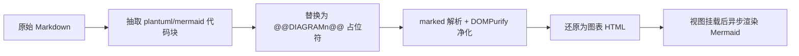
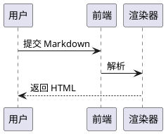
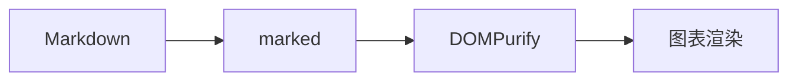
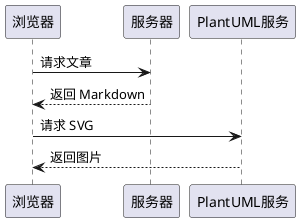
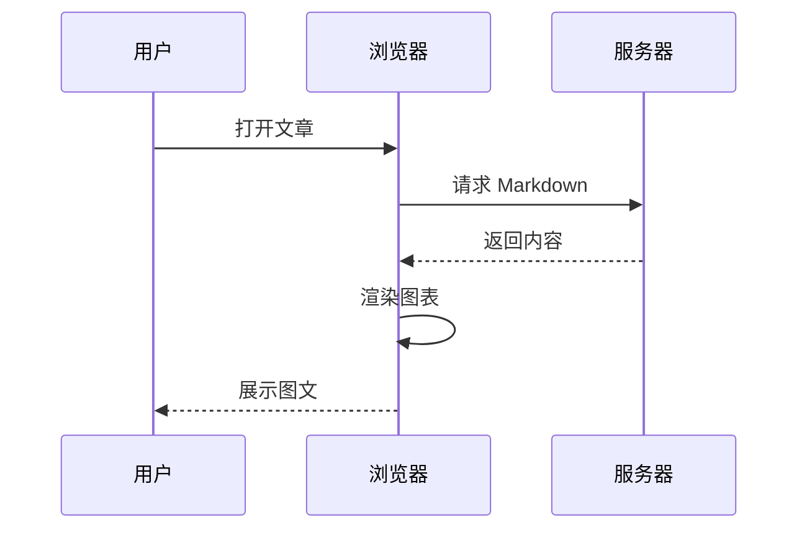

博客的文章一直只支持纯文本代码块，这次想把流程图、时序图也支持上，于是接了 **PlantUML** 和 **Mermaid** 两种语法。顺手还揪出了两个一直存在但没暴露的问题：Mermaid 渲染出来没有文字，以及 GitHub Actions 部署莫名失败。

## 目标

- ` ```plantuml ` 代码块 → 渲染成 PlantUML 图片
- ` ```mermaid ` 代码块 → 渲染成 Mermaid SVG
- 其他代码块行为完全不变
- 图表语法出错时给出友好提示，不能让整页崩掉

## 整体设计：占位符 + 异步后处理

现有的 `renderMarkdown()` 是同步的，而且被两个页面的 `computed` 直接调用。而 Mermaid 的渲染是异步的（要 await），两者对不上。硬改异步会牵连所有调用方，所以沿用了项目里处理 KaTeX 公式的同一套思路——**占位符**。



具体分工：

| 阶段 | 做的事 |
| --- | --- |
| 解析前 | 正则抽取 ` ```plantuml ` / ` ```mermaid ` 围栏块，存进数组，原位替换成 `@@DIAGRAM0@@` 占位符 |
| marked + DOMPurify | 只看到普通文本占位符，不受影响 |
| 净化后 | 占位符还原：PlantUML 直接输出 ``，Mermaid 输出带 `data-mermaid` 的占位 `<div>` |
| 视图挂载后 | `watch(html, …, { flush: 'post' })` 调 `renderDiagrams(container)`，异步渲染 Mermaid SVG |

这里有个顺带的好处：图表代码是在 KaTeX 抽取**之前**被抽走的，所以图表里的 `$` 不会再被误当成公式。

另外一个小坑：占位符独占一行时会被 marked 包进 `<p>`，直接替换会变成 `<p>` 套 `<div>` 的非法结构，所以要先整体替换掉 `<p>@@DIAGRAMn@@</p>` 再处理裸占位符。

## PlantUML：用远程图片，最省事

PlantUML 不需要本地渲染，编码后交给服务器出图即可：

```javascript
import plantumlEncoder from 'plantuml-encoder'

const url = 'https://www.plantuml.com/plantuml/svg/' + plantumlEncoder.encode(code)
```

关键是**必须处理加载失败**——网络不通或语法错误时服务器会返回一张错误图或直接 404，不能让文章页留个破图：

```javascript
const fail = () => { /* 把容器替换成错误提示框 */ }
// 懒加载图片可能在监听器绑定前就已经失败，所以要补一次 complete 判断
if (img.complete && img.naturalWidth === 0) fail()
else img.addEventListener('error', fail, { once: true })
```

## Mermaid：动态加载 + 手动渲染

```javascript
mermaid.initialize({ startOnLoad: false, theme: 'neutral' })
const { svg } = await mermaid.render(uniqueId(), code)
```

三个要点：

1. **`startOnLoad: false`**：否则 Mermaid 会自动扫描整个 DOM 找图表，和 Vue 的渲染时机打架。
2. **唯一 ID**：用 `mermaid-${Date.now()}-${counter}-${random}`，防止多次渲染时 DOM id 冲突。
3. **动态 `import('mermaid')`**：核心包不小，改成按需加载后，首页完全不受影响，只有真的写了 mermaid 图的文章页才会去下载。elk、cytoscape 这些重型布局引擎 Mermaid 本身就是懒加载的。

## 最大的坑：Mermaid 渲染出来没有文字

功能做完第一次在浏览器里看，PlantUML 正常，**Mermaid 只有形状没有字**。

原因在 DOMPurify。Mermaid 生成的 SVG 里，文字标签放在 `<foreignObject>` 内部的 HTML 元素中，节点配色依赖内联 `<style>` 标签。而我当时只开了 svg 画像：

```javascript
// ❌ 错误：foreignObject 里的 HTML 和 <style> 全被剥掉
DOMPurify.sanitize(svg, { USE_PROFILES: { svg: true } })
```

正确的配置要同时放行 html 画像和 style 标签：

```javascript
// ✅ 正确
const clean = DOMPurify.sanitize(svg, {
  USE_PROFILES: { svg: true, svgFilters: true, html: true },
  ADD_TAGS: ['style']
})
```

如果想更彻底地避开这个问题（不依赖 foreignObject），也可以让 Mermaid 用纯 SVG 文本渲染标签：

```javascript
mermaid.initialize({ startOnLoad: false, theme: 'neutral', flowchart: { htmlLabels: false } })
```

两种方案任选其一即可，前者兼容性更好，后者对消毒配置要求更松。

## 顺手修的性能优化

- **SVG 缓存**：以 `主题::代码` 为键缓存消毒后的结果，重复出现的相同图表直接复用，上限 100 条 FIFO
- **懒加载**：PlantUML 图片加 `loading="lazy"`，页面滚到才请求
- **错误兜底**：Mermaid 渲染失败时展示具体错误信息，并把残留的临时节点清理掉

## 另一个坑：GitHub Actions 部署失败

代码写完上传到 GitHub，Actions 却连续失败，`npm ci` 这一步 5 秒就挂，报：

```
npm error `npm ci` can only install packages when your package.json
and package-lock.json are in sync
npm error Missing: @emnapi/runtime@1.11.3 from lock file
```

第一反应是 lock 文件没传上去，但传了还是失败。真正的原因有点隐蔽：**lock 文件是在 Windows 上生成的**。

对比部署一直成功的旧 lock 和本地新 lock 才看出来，Vite 8 底层的 rolldown 有一堆跨平台原生绑定，其中 `@rolldown/binding-wasm32-wasi` 会带出 `@emnapi/runtime`、`@napi-rs/wasm-runtime` 这条依赖链。旧 lock 里有这些条目，而 Windows 上执行 `npm install` 时 npm 认为"本机用不上"，直接把它们裁掉了。CI 跑在 Linux 上，`npm ci` 的严格同步校验发现 lock 缺条目，立刻退出。

也就是说，**在 Windows 上重新生成整个 lock 会破坏跨平台一致性**。解决办法二选一：

- 要么在 Linux 上生成 lock（Docker / WSL 里跑一遍）
- 要么 CI 里改用 `npm install`，让它在目标平台自行补齐

个人博客项目选了后者，改动就一行：

```yaml
- run: npm install   # 原来是 npm ci
```

顺便提醒一句：`npm ci --dry-run` 虽然看起来是只读校验，**但它会真的改写 package-lock.json**（把条目裁剪掉），别拿它当无害的检查命令用。

## 用法

````markdown



````

## 效果

````markdown



````

## 小结

这次主要记住三件事：

1. **同步渲染管线接异步图表**，占位符 + 挂载后处理是最省事的解法，不用动现有渲染主流程
2. **消毒配置要匹配渲染产物**，Mermaid 的文字藏在 `foreignObject` + `<style>` 里，只开 svg 画像会把字吃掉
3. **跨平台项目的 lock 别在 Windows 上重生成**，可选依赖会被裁掉，Linux CI 上 `npm ci` 必挂