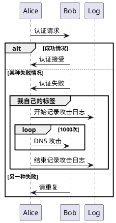
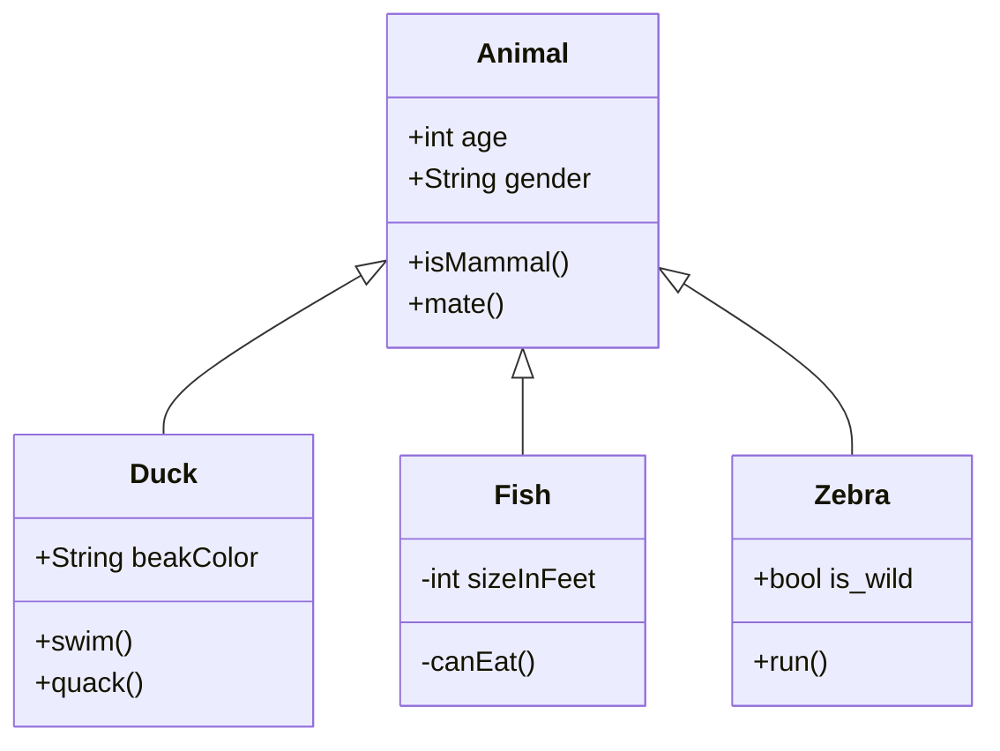

## plantuml测试

```plantuml
@startuml
Alice -> Bob: 认证请求

alt 成功情况

    Bob -> Alice: 认证接受

else 某种失败情况

    Bob -> Alice: 认证失败
    group 我自己的标签
    Alice -> Log : 开始记录攻击日志
        loop 1000次
            Alice -> Bob: DNS 攻击
        end
    Alice -> Log : 结束记录攻击日志
    end

else 另一种失败

   Bob -> Alice: 请重复

end
@enduml
```
## mermaid测试

```mermaid
classDiagram
    Animal <|-- Duck
    Animal <|-- Fish
    Animal <|-- Zebra
    Animal : +int age
    Animal : +String gender
    Animal: +isMammal()
    Animal: +mate()
    class Duck{
      +String beakColor
      +swim()
      +quack()
    }
    class Fish{
      -int sizeInFeet
      -canEat()
    }
    class Zebra{
      +bool is_wild
      +run()
    }
```